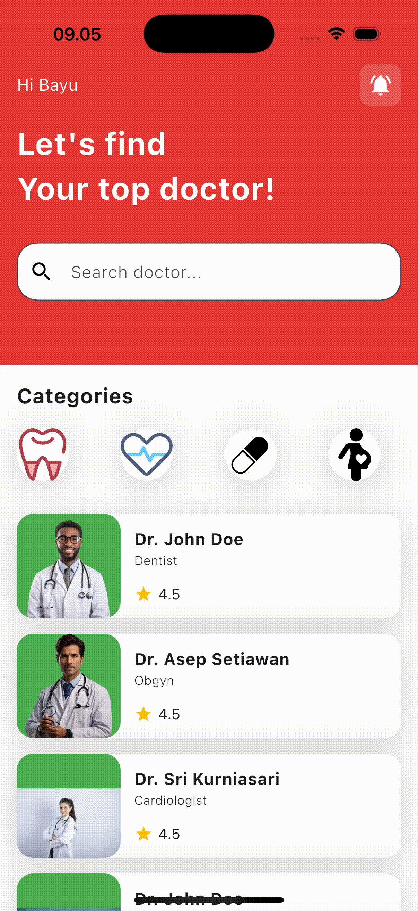

# Meet Doctor

A simple and functional **Flutter** application that allows users to browse a list of doctors based on their specialties. Users can filter doctors by category, view doctor details, and book an appointment by selecting a date and time.

## Features
- Browse doctors by specialty
- View doctor details (name, specialty, experience, rating, etc.)
- Book an appointment with date and time selection

## Screenshots
_Add screenshots here if available_

## Demo



_If the GIF does not display, open it directly from the `result/play.gif` file._

## Installation

1. Clone the repository:
   ```bash
   git clone https://github.com/bayusedana26/meet_doctor.git
   cd meet_doctor
   ```
2. Install dependencies:
   ```bash
   flutter pub get
   ```
3. Run the app:
   ```bash
   flutter run
   ```

## Project Structure
```plaintext
meet_doctor/
├── lib/
│   ├── main.dart # Entry point
│   ├── model/    # Data models
│   ├── view/     # UI screens
├── assets/       # Images & other assets
├── result/
│   ├── play.mp4   # Demo video
│   ├── play.gif   # Demo GIF
└── pubspec.yaml   # Dependencies & configuration
```

## Dependencies
Make sure you have the following dependencies in your `pubspec.yaml`:
```yaml
dependencies:
  flutter:
    sdk: flutter
  cupertino_icons: ^1.0.6
  provider: ^6.1.3
  intl: ^0.18.1  # For date formatting
```

## Contributing
Feel free to contribute by submitting a pull request or opening an issue.

## License
This project is licensed under the MIT License - see the [LICENSE](LICENSE) file for details.

---
🚀 **Developed with Flutter**